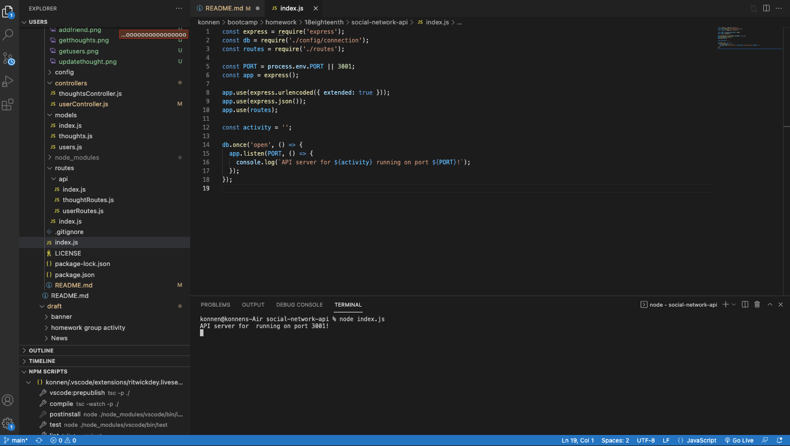
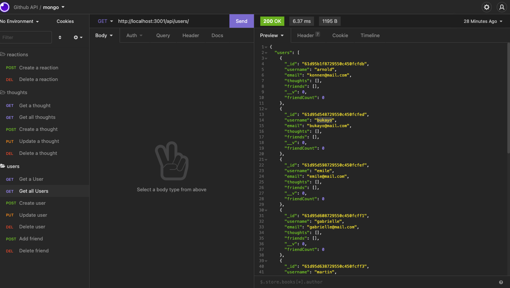
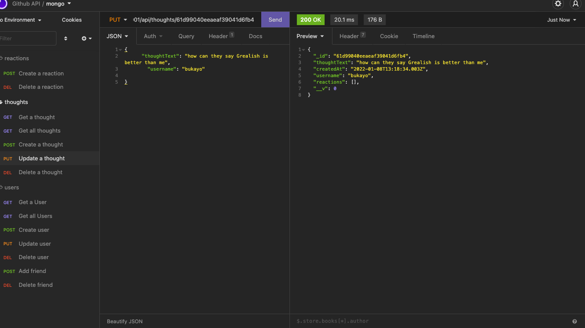
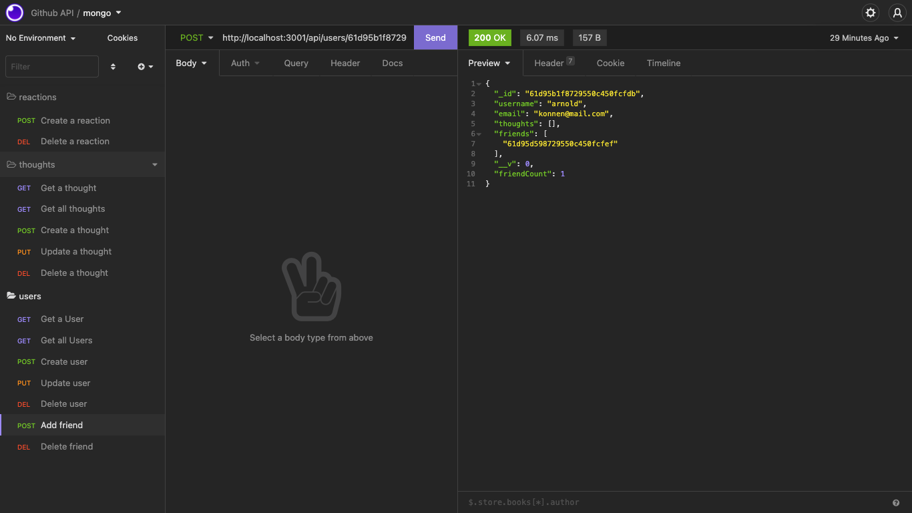

# social-network-api

## Table of Content 
* [Description](#description)
* [Justification](#justification)
* [Technologies](#technologies)
* [Installation](#installation)
* [Usage](#usage)
* [Contributing](#contributing)
* [Testing](#testing)
* [Contact](#contact)
* [License](#license)
* [Questions](#questions)

## Description
This Social media api is created to allow users make friends and posts as well as comment on other friends post. 

## Justification

This tool uses Mongo DB to be able to create a social media app that uses an API. Mongo is a versatile database so learning it is helpful with knowing mysql.   It is a good project to work on as it encompasses Mongo which brings us closer to getting to fullly understanding MERN.

## Technologies
JavaScript, Node JS, Expres, Mongo DB

## Installation

On inital load, use npm install to install the required dependencies.  Use node to load the app (node index.js).  The app will then connect to the localhost and can be accessed via Mongo compass and Insomnia to view the API

## Usage

Walkthrough video link: https://watch.screencastify.com/v/BKItKpOcXESryMfuri5v

Follow the instructions above to install and run the app.  Then follow through the requests in Insomnia.  At a later stage, a front end aspect could be added to this project.  

)

WHEN I open API GET routes in Insomnia for users and thoughts
THEN the data for each of these routes is displayed in a formatted JSON

WHEN I test API POST, PUT, and DELETE routes in Insomnia
THEN I am able to successfully create, update, and delete users and thoughts in my database

WHEN I test API POST and DELETE routes in Insomnia
THEN I am able to successfully create and delete reactions to thoughts and add and remove friends to a user’s friend list

## Contributing
Project can be accesed here - https://github.com/konnenhannaford/social-network-api

Repo is Public so freely available using MIT Licence. 

## Testing
No testing information as of yet

## Questions
Contact me if you have any queries:

Github UserName - konnenhannaford

Github Profile - https://github.com/konnenhannaford

Contact me for further info and any questions

Email - konnen23@gmail.com

## License
MIT license
Copyright 2021 Read Me Generator